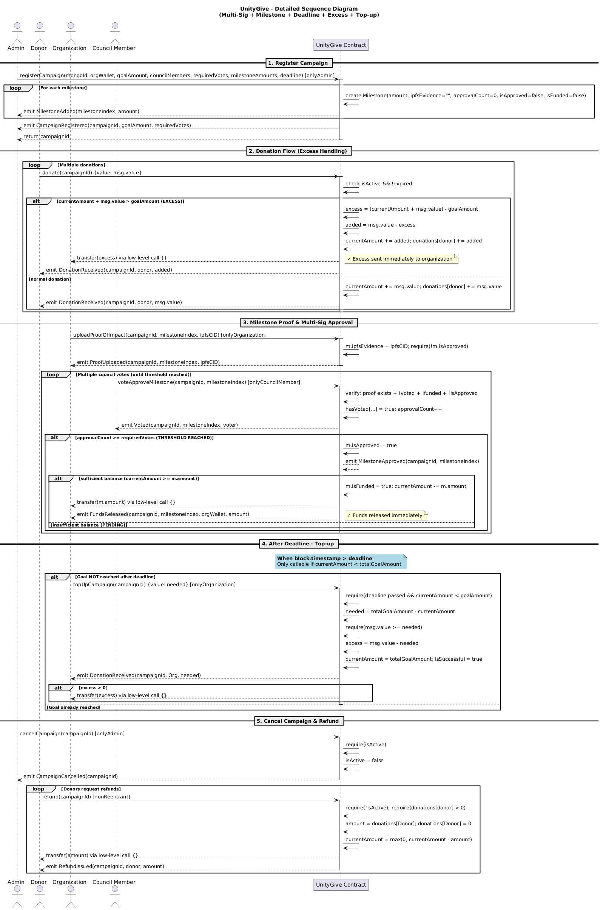

# UnityGive Smart Contracts

This project contains the Solidity smart contracts for UnityGive. It uses [Hardhat](https://hardhat.org/) as the development environment and TypeScript for the testing and deployment scripts.

## Key Features

- Milestone-based funding with Proof of Impact via IPFS
- Multi-Sig Council for secure fund release
- Deadline & Top-up mechanism
- Automatic excess donation handling
- Refund support when campaign is cancelled

---

## UML Diagram

### Sequence Diagram

The following diagram illustrates the main interaction flows in the UnityGive smart contract:



*(Sequence Diagram showing Register Campaign, Donation with excess handling, Proof upload, Multi-Sig voting, Top-up after deadline, and Refund flow)*

## Prerequisites

- [Node.js](https://nodejs.org/) (v16 or higher recommended)
- npm or yarn

## Installation

1. Install the project dependencies:
   ```shell
   npm install
   ```

2. Create a `.env` file in the root of the `smart-contracts` folder to store your environment variables required for testnet deployment:
   ```env
   # Required for deploying to Sepolia testnet
   SEPOLIA_RPC_URL="https://eth-sepolia.g.alchemy.com/v2/YOUR_API_KEY"
   DEPLOYER_PRIVATE_KEY="your_wallet_private_key_here"
   ```

## Development Commands

### Compile Contracts
Generate the contract artifacts and TypeChain types:
```shell
npx hardhat compile
```

### Run Tests
Execute the contract test suite (`test/UnityGive.test.js`):
```shell
npx hardhat test
```

### Local Network Deployment
Deploy and interact with the contracts on a local Hardhat network:

1. Start the local Hardhat node in one terminal:
   ```shell
   npx hardhat node
   ```

2. In a second terminal, deploy the contract to the local network:
   ```shell
   npx hardhat run scripts/deploy.ts --network localhost
   ```

### Testnet Deployment (Sepolia)
Deploy the contract to the Sepolia testnet. Ensure your `.env` file is properly configured and your deployer wallet is funded with Sepolia ETH:
```shell
npx hardhat run scripts/deploy.ts --network sepolia
```

## Project Structure

- `contracts/UnityGive.sol`: The core Solidity smart contract for UnityGive.
- `scripts/`: Deployment scripts (`deploy.ts`, `deploy.js`).
- `test/`: Contract test suite.
- `hardhat.config.ts`: Main Hardhat project configuration (networks, compiler versions).
- `typechain-types/`: TypeScript typings automatically generated from the contracts.

## Smart Contract Overview
UnityGive supports the following main actors and flows:

- Admin: Registers campaigns with milestones, council, and deadline
- Donor: Donates ETH (excess is auto-sent to organization)
- Organization: Uploads IPFS proof and can top-up after deadline
- Council Member: Votes to approve milestones
- Refund: Available after campaign cancellation

Key mechanisms include automatic pending milestone release, excess handling, and time-bound fundraising.